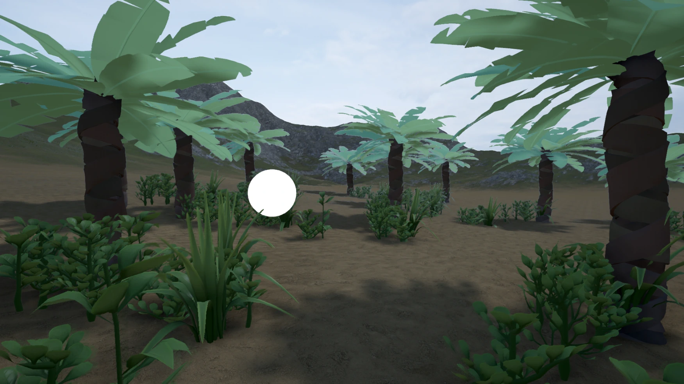
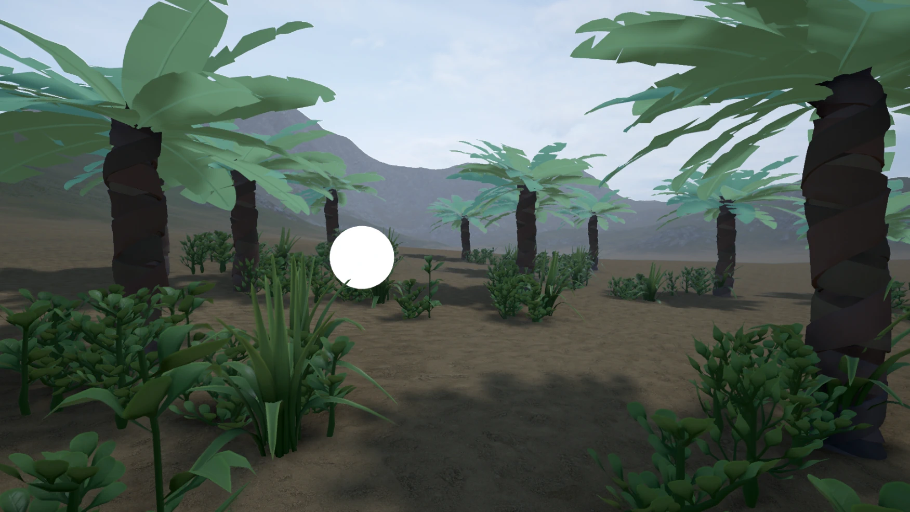
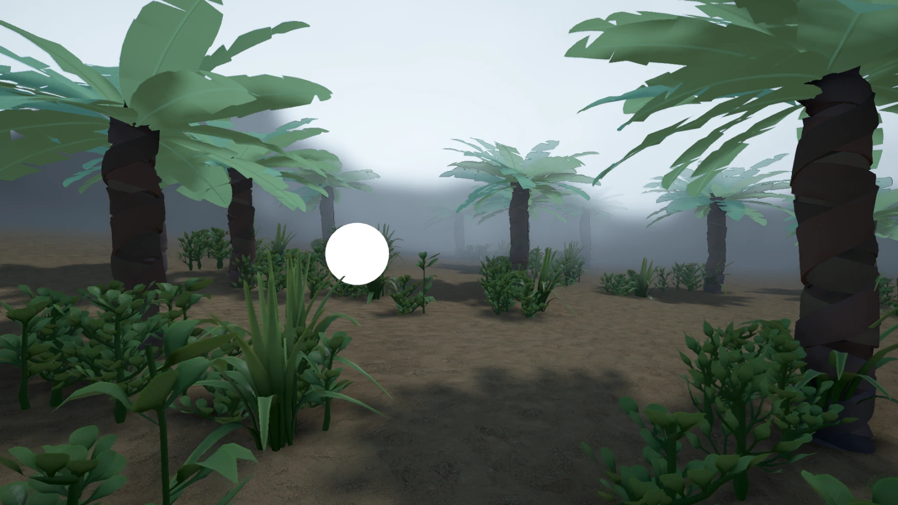
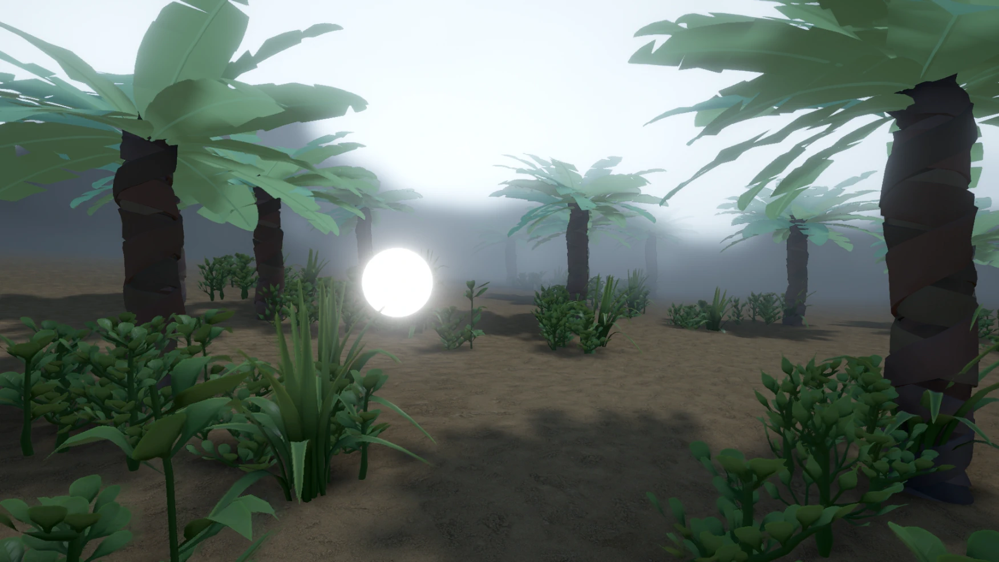

# Screen Space Mulit Scatter for Unity's Post Processing Stack v2
Post Processing Effect that mimics light getting scattered though fog.

Based on the [Keijiro Takahashi's Streak Effect](https://github.com/keijiro/Kino) and [SSMS by OCASM](https://github.com/OCASM/SSMS).

Examples
-

No fog

Built-in Fog

Built-in Fog + SSMS

Built-in Fog + SSMS + Bloom

Known Issues
-
The effect will not enclose transparent objects. That avoids artifact with TAA and transparent object disappearing in the fog, even if they're in the foreground. This can be changed by setting PostProcessEvent.BeforeTransparent to PostProcessEvent.BeforeStack. 
